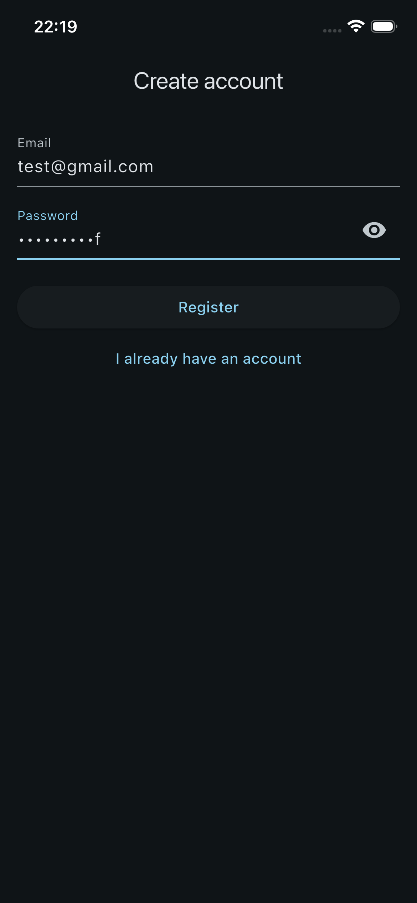
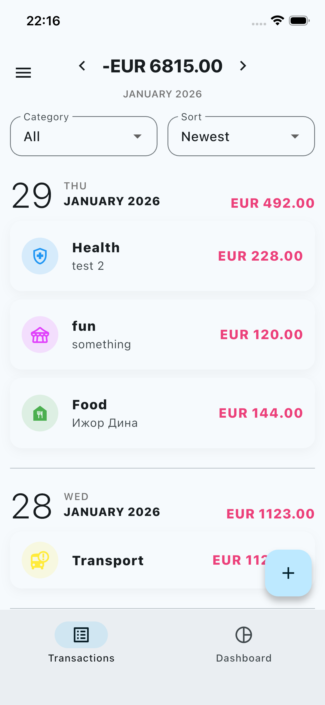
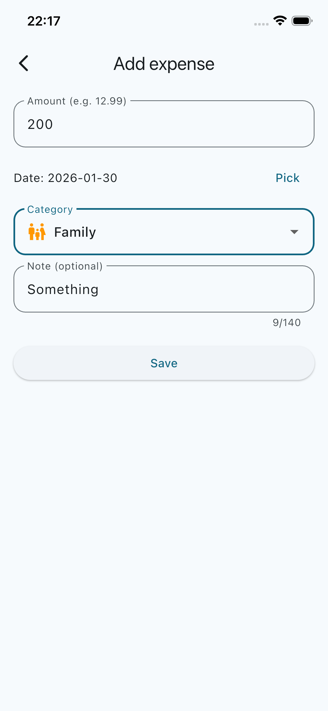
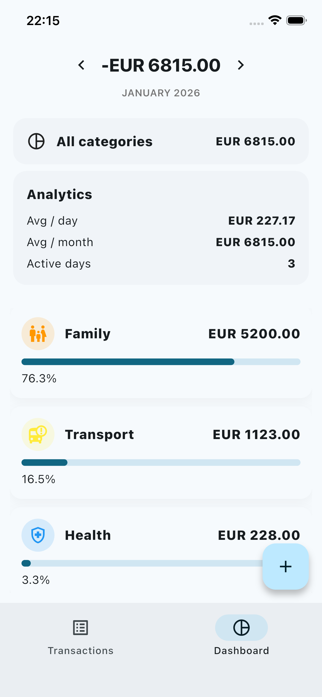
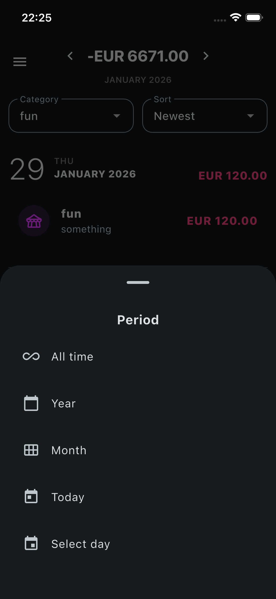
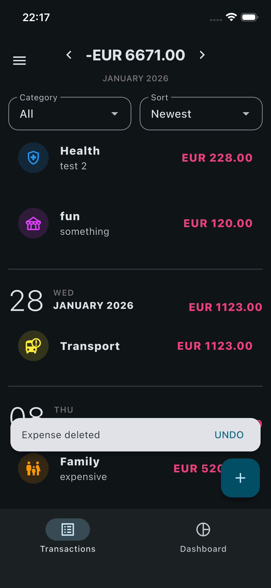

# Expense Tracker (Flutter + Firebase)

Personal expense tracker app built with **Flutter** and **Firebase**.  
Supports **multi-user auth**, **CRUD expenses**, **period-based analytics**, and a clean **Material 3 UI**.

---

## ✨ Features

### 🔐 Authentication
- Email & password auth (Firebase Auth)
- Data isolation per user (by UID)
- Friendly validation and error messages

### 💸 Expenses
- Add / edit / delete expenses
- Undo delete (SnackBar)
- Categories + optional notes

### 📅 Periods & analytics
- Day / Month / Year / All time
- Period navigation + date picker (no future dates)
- Dashboard: totals + category breakdown (progress bars)
- Tap category → open filtered transactions

### 🔎 Sorting
- Newest (grouped by day)
- Amount ↑ / ↓ (global within selected period)

### 🎨 UI / UX
- Material 3
- Light / Dark / System theme
- Empty / Loading / Error states

### ☁️ Cloud sync
- Firestore backend (real-time updates)
- User data stored under:
  `users/{uid}/expenses`

---

## 🛠 Tech Stack
- **Flutter (Material 3)**, **Dart**
- **Firebase Auth**, **Cloud Firestore**
- **Riverpod** (state management)
- **GoRouter** (navigation)

---

## 📸 Screenshots

<p float="left">
  
  
  
</p>

<p float="left">
  
  
  
</p>

---

## 🚀 Getting Started

### Prerequisites
- Flutter SDK (stable)
- A Firebase project
- Android Studio / Xcode (emulator) or a physical device

### 1) Clone the repository
```bash
git clone https://github.com/<your-username>/expense-tracker-flutter.git
cd expense-tracker-flutter
flutter pub get